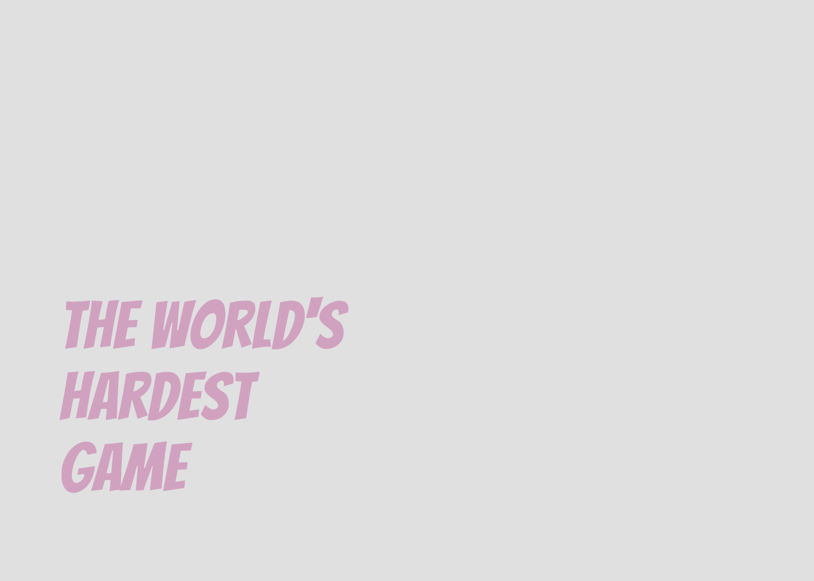

  

Este proyecto es una reinterpretación del clásico The World’s Hardest Game, con una implementación básica funcional y una serie de extensiones que amplían su jugabilidad.

## Objetivo del juego

El jugador debe llegar al objetivo final de cada nivel evitando obstáculos en movimiento (y opcionalmente recolectando todas las monedas del escenario) sin perder todas sus vidas.

## Controles 

El jugador se desplaza usando las flechas del teclado.

## Funcionalidades implementadas

- Movimiento del jugador en las cuatro direcciones.
- Reinicio de posición al colisionar con paredes.
- Sistema de vidas que se reducen al colisionar con obstáculos móviles.
- Obstáculos que se desplazan horizontal o verticalmente, rebotando al alcanzar los - límites.
- Monedas coleccionables que desaparecen al ser recogidas y aumentan un contador de - puntos.
- Interfaz gráfica que muestra en pantalla las vidas restantes y las monedas recolectadas.
- Checkpoints: el jugador se reinicia desde el último punto de control alcanzado.
- Pantallas de éxito y fin de partida: aparecen mensajes temporales que indican si se ha completado el nivel o si se ha perdido, con transiciones automáticas.
- Puertas automáticas: se abren y cierran en ciclos controlados.
- Teletransportes: permiten mover al jugador de una zona a otra del nivel al entrar en un punto de teletransporte.
- Menú principal: pantalla inicial con opciones para iniciar partida, seleccionar nivel o salir del juego.
- Varios niveles: implementación de varios niveles con diferentes configuraciones y retos.

